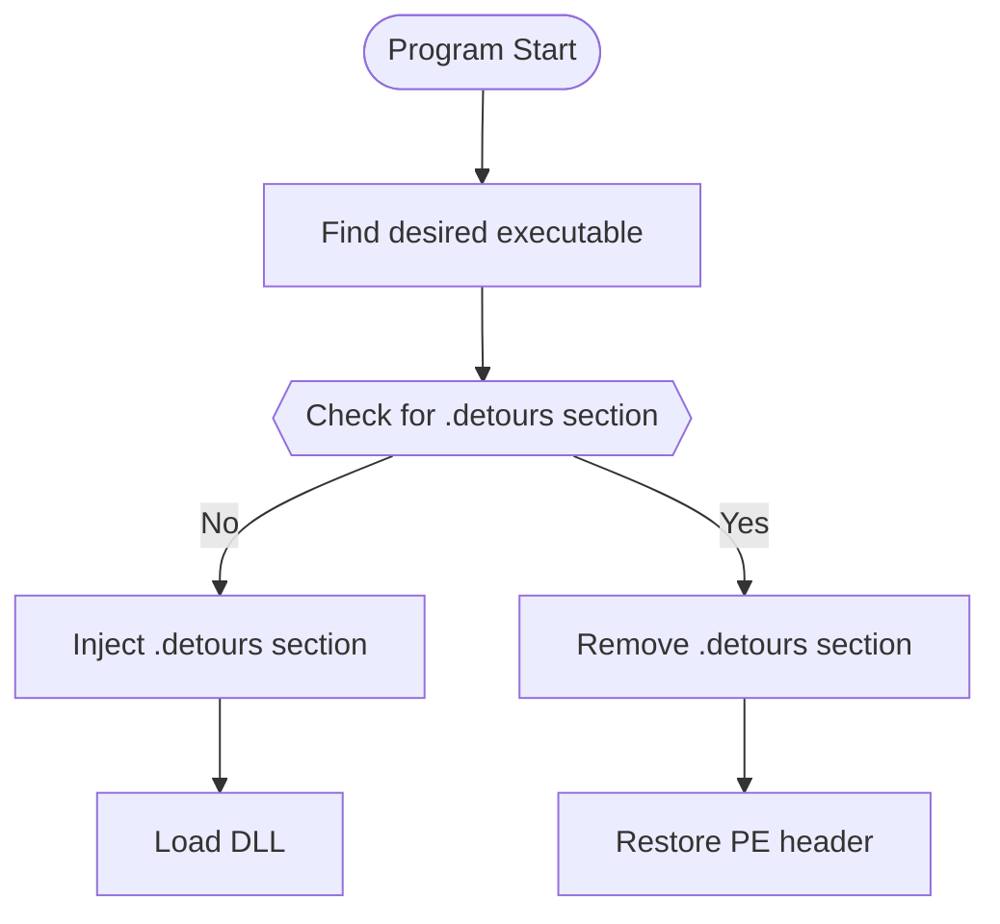

# cmw-coder-loader

This is a program that uses Microsoft's [Detours](https://github.com/microsoft/Detours) library to inject a DLL into a
target executable and force process to load the DLL.

## Overview

The format of a typical Windows PE binary file (normally a `.exe` file) look like this:

|            **DOS Header**             |
|:-------------------------------------:|
|            **PE (W/COFF)**            |
|   **.text Section** Program Code   |
| **.data Section** Initialized Data |
|  **.idata Section** Import Table   |
|  **.edata Section** Export Table   |
|           **Debug Symbols**           |

Detours creates a new .detours section between the export table and the debug symbols. The new section contains a
detours header record and a copy of the original PE header. If modifying the import table, Detours creates the new
import table, appends it to the copied PE header, then modifies the original PE header to point to the new import table.
Finally, Detours writes any user payloads at the end of the .detours section. The modified PE file may look like this:

|                                          **DOS Header**                                          |
|:------------------------------------------------------------------------------------------------:|
|                       **PE (W/COFF)** _Modified_ Using .detour Section                        |
|                                **.text Section** Program Code                                 |
|                              **.data Section** Initialized Data                               |
|                           **.idata Section** _Unused_ Import Table                            |
|                                **.edata Section** Export Table                                |
| **.detours Section** detour header original PE header new import table user payloads |
|                                        **Debug Symbols**                                         |

Detours can reverse modifications to the Windows binary by restoring the original PE header from the .detours section
and removing the .detours section.

## Flowchart

